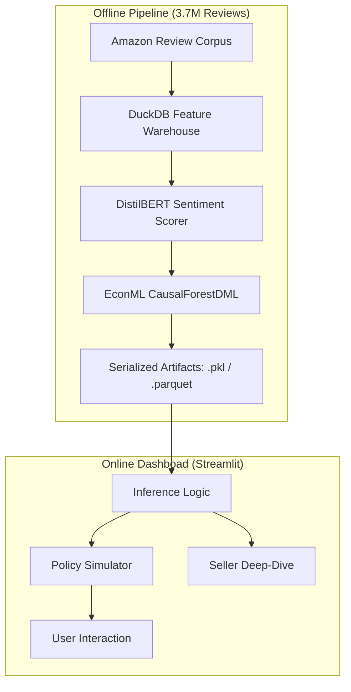

# Architecture
ReturnIQ uses an **Offline-to-Online (O2O)** architecture to maintain high-fidelity causal inference with zero-latency reporting.

### Data Flow
1. **Ingestion**: Raw review JSONs are normalized into a relational DuckDB instance.
2. **Identification**: We use a Double ML strategy to isolate the Treatment (Seller Quality) from Confounders.
3. **Serialization**: The final Heterogeneous Treatment Effects (CATE) are saved alongside the full estimator.
4. **Telemetry**: The Streamlit frontend uses the serialized model for live 'What-if' forecasting.
