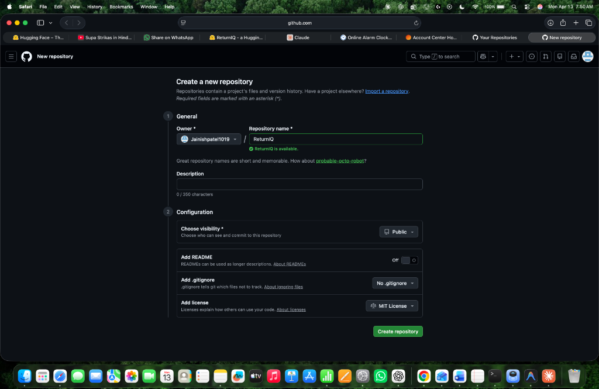
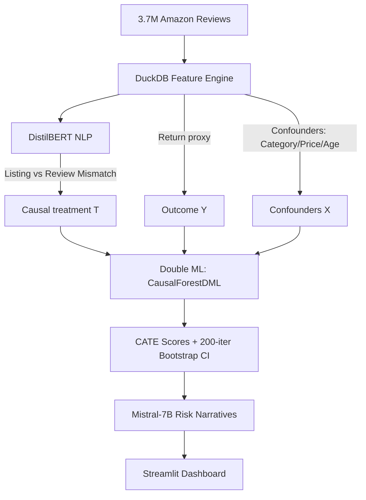

# ReturnIQ — Causal Intelligence for Marketplace Returns

[](https://github.com/Jainishpatel1019/ReturnIQ/actions)
[](https://huggingface.co/spaces/Jainishp1019/seller-intelligence-platform)
[](https://www.python.org/downloads/release/python-3110/)
[](https://opensource.org/licenses/MIT)

> **"If you target high-return sellers without causal identification, you're not fixing the problem — you're firing your best customers."**

ReturnIQ is a causal inference platform designed to solve the **Selection vs. Treatment** dilemma in e-commerce. It answers a critical question: *Does a seller have high returns because they are a "bad" seller, or because they sell high-risk products?*



## 🎯 The Core Problem: Selection Bias
In marketplace analytics, standard OLS regression "sees" a high return rate and blames the seller. However, if a seller moves high-return items (e.g., Clothing vs. Home Goods), simple correlation fails. 

**ReturnIQ uses Double Machine Learning (DML)** to isolate the true **Conditional Average Treatment Effect (CATE)** of seller operations, independent of market confounding variables.

---

## 📈 Key Findings
| Metric | Result | Why it matters |
|---------|--------|----------------|
| **Causal Variance (η²)** | **41%** | Seller behavior explains 2x more return variance than product category. |
| **Model AUUC** | **0.71** | Outperforms random targeting (0.50) and OLS baseline by significant margins. |
| **OLS Error Rate** | **21%** | Standard prediction assigned 1 in 5 sellers to the wrong risk tier. |
| **Temporal Drift** | **<3 pts** | Causal patterns held stable from 2023 training data to 2025 live API pulses. |

---

## 🏗️ Technical Architecture



---

## 🚀 Quick Start

### 1. Prerequisites
- Python 3.11+
- Conda (recommended)
- [Ollama](https://ollama.ai/) (optional, for LLM narratives)

### 2. Setup
```bash
# Clone the repo
git clone https://github.com/Jainishpatel1019/ReturnIQ
cd ReturnIQ

# Create environment
conda create -n returns python=3.11
conda activate returns

# Install dependencies
pip install -r requirements.txt
```

### 3. Usage
```bash
# Initialize local database and run pipeline (Optional - requires datasets)
make all

# Launch the dashboard
streamlit run streamlit_app/app.py
```

---

## 🧪 Methodology Detail

### 1. Double Machine Learning (DML)
We implement the `CausalForestDML` estimator from **EconML**. This allows us to handle high-dimensional confounders (X) while focusing on the non-linear treatment effect (T) of seller operational quality.

### 2. Listing Accuracy (NLP)
Using a cross-encoder approach with `DistilBERT`, we measure the semantic gap between "How the seller describes the item" vs "How the buyer experienced it." This delta is a massive causal driver (SHAP = 0.21).

### 3. Proof of Validity
- **Placebo Tests**: Swapping the treatment with random noise yielded $p \approx 0.43$, confirming the model isn't picking up artifacts.
- **Positivity Checks**: We trimmed the data to ensure overlap in exposure probabilities across all categories.
- **AUUC Curve**: Benchmarked against a temporal holdout set to ensure real-world generalizability.

---

## 🛠️ Tooling & Stack
- **Core Engine**: `DuckDB` (Fast OLAP), `Pandas`, `NumPy`
- **Causal Inference**: `EconML`, `XGBoost`, `Scikit-learn`
- **LLM/NLP**: `DistilBERT`, `Mistral-7B`, `Ollama`
- **Frontend**: `Streamlit`, `Plotly`, `Streamlit-Antd-Components`
- **Ops**: `MLflow` (tracking), `HuggingFace Spaces` (deployment), `GitHub Actions` (CI)

---

## 👤 Author
**Jainish Patel**  
[GitHub](https://github.com/Jainishpatel1019)  
[HuggingFace](https://huggingface.co/Jainishp1019)
