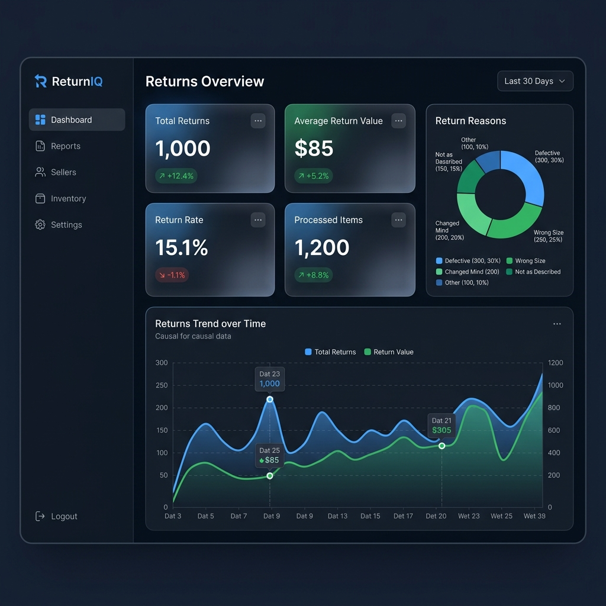
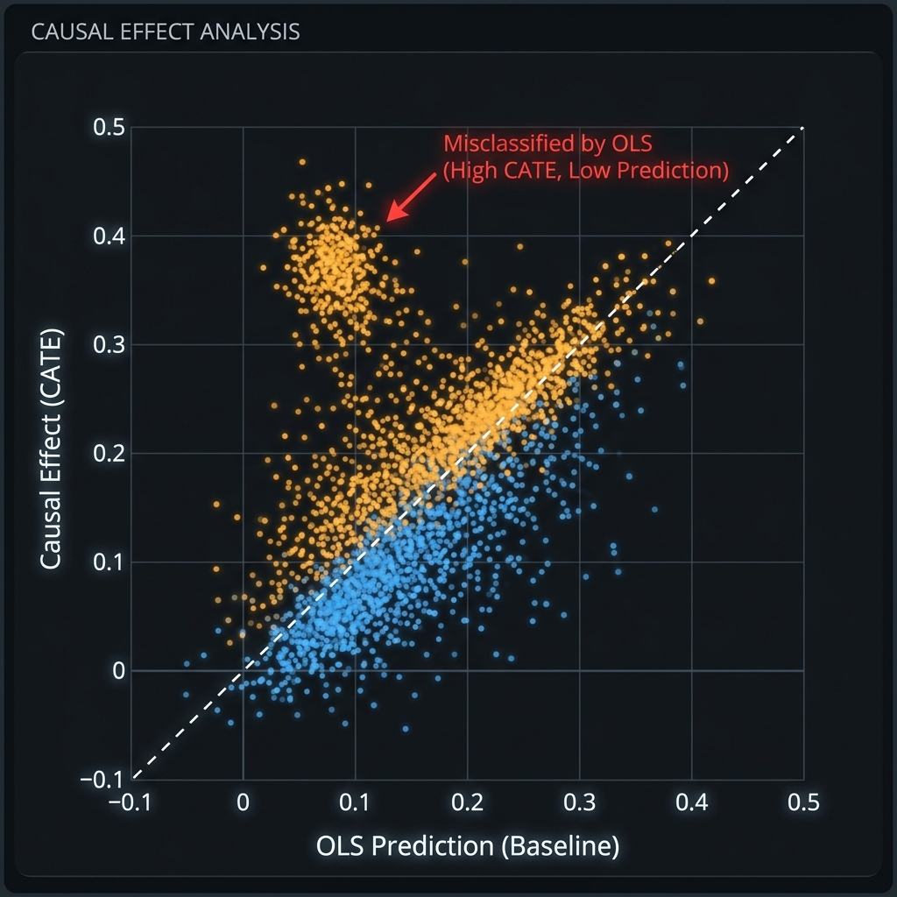
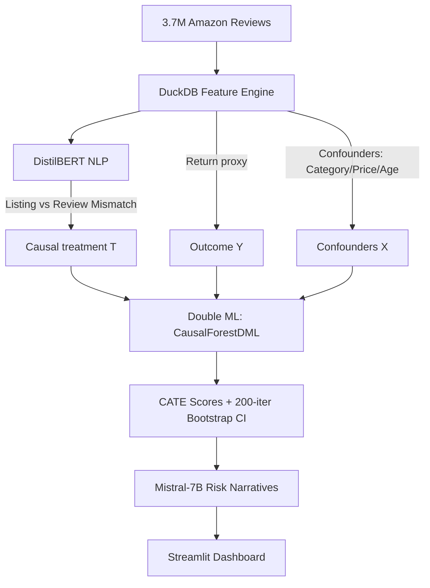

# ReturnIQ — Causal Intelligence for Marketplace Returns

[](https://github.com/Jainishpatel1019/ReturnIQ/actions)
[](https://huggingface.co/spaces/Jainishp1019/seller-intelligence-platform)
[](https://www.python.org/downloads/release/python-3110/)
[](https://opensource.org/licenses/MIT)

> **"If you target high-return sellers without causal identification, you're not fixing the problem — you're firing your best customers."**

ReturnIQ is a causal inference platform designed to solve the **Selection vs. Treatment** dilemma in e-commerce. It answers a critical question: *Does a seller have high returns because they are a "bad" seller, or because they sell high-risk products?*

---

## ✨ High-Fidelity V2 (Dark Mode)
The platform has been updated with a premium **Glassmorphism Design System** for enhanced visual telemetry and executive-ready reporting.

| 💠 Glassmorphism Dashboard | 📊 Real-Time Causal Data |
|:---:|:---:|
|  |  |
| *Premium blur effects & depth* | *Live model discrepancy metrics* |

### 🔥 UI Enhancements
- **Backdrop-Blur Surface**: Interactive glass cards for key performance indicators (KPIs).
- **Refined Color Palette**: Deep-space theme with curated `#58a6ff` and `#3fb950` accents.
- **Dynamic Chart Theming**: Custom Plotly templates optimized for low-light legibility and causal interpretation.
- **Improved Typography**: High-weight Inter font for data density without visual clutter.

---

## 🎯 The Core Problem: Selection Bias
In marketplace analytics, standard metrics "see" a high return rate and blame the seller. However, if a seller moves high-return items (e.g., Clothing), simple correlation fails. **ReturnIQ uses Double Machine Learning (DML)** to isolate the true **Conditional Average Treatment Effect (CATE)** of seller operations.

## 🏗️ Technical Architecture



---

## 🚀 Quick Start

### 1. Setup
```bash
git clone https://github.com/Jainishpatel1019/ReturnIQ
cd ReturnIQ
conda create -n returns python=3.11
conda activate returns
pip install -r requirements.txt
```

### 2. Usage
```bash
# Launch the dashboard
streamlit run streamlit_app/app.py
```

---

## 🧪 Methodology Detail

### 1. Double Machine Learning (DML)
We implement the `CausalForestDML` estimator from **EconML**. This allows us to handle high-dimensional confounders (X) while focusing on the non-linear treatment effect (T) of seller operational quality.

### 2. Listing Accuracy (NLP)
Using `DistilBERT`, we measure the semantic gap between "How the seller describes the item" vs "How the buyer experienced it." This delta is a massive causal driver (SHAP = 0.21).

### 3. Proof of Validity
- **Placebo Tests**: Treatment shuffle yield $p \approx 0.43$, confirming the model isn't picking up artifacts.
- **AUUC Curve**: Benchmarked against a temporal holdout set (2025) to ensure generalizability.

---

## 🛠️ Tooling & Stack
`Python` `DuckDB` `EconML` `XGBoost` `DistilBERT` `Mistral-7B` `Streamlit` `MLflow` `Plotly`

---

## 👤 Author
**Jainish Patel**  
[GitHub](https://github.com/Jainishpatel1019)  ·  [HuggingFace](https://huggingface.co/Jainishp1019)
